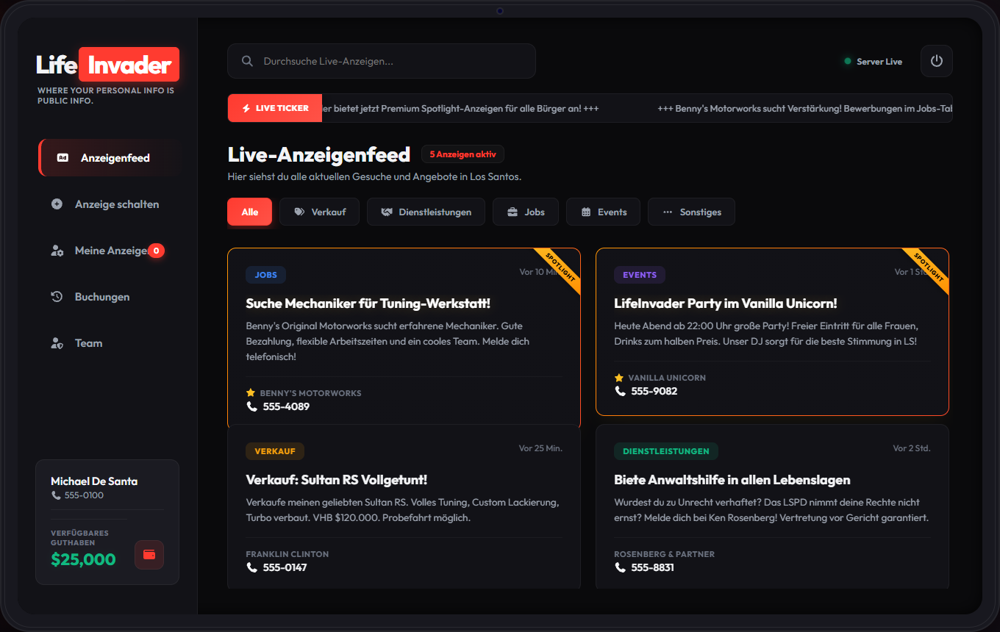
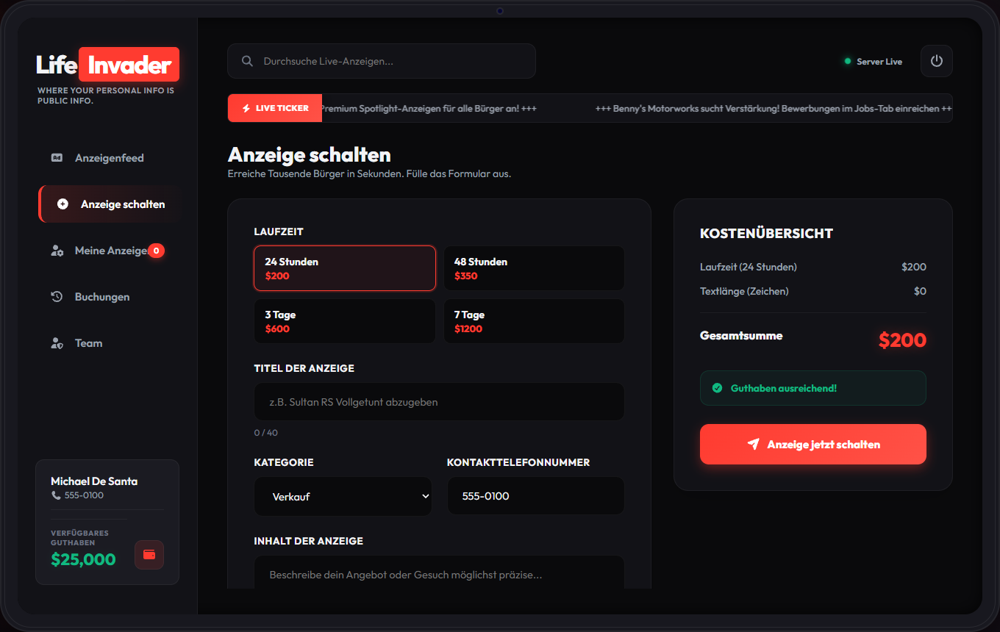
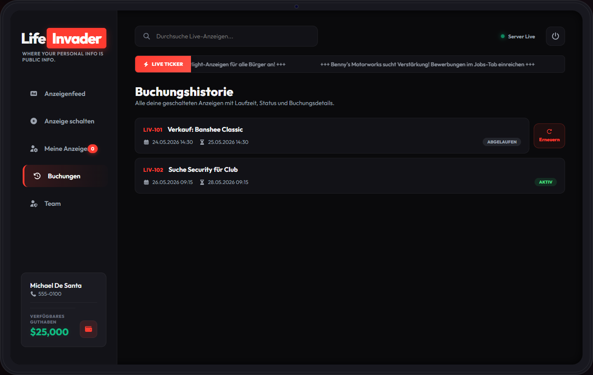
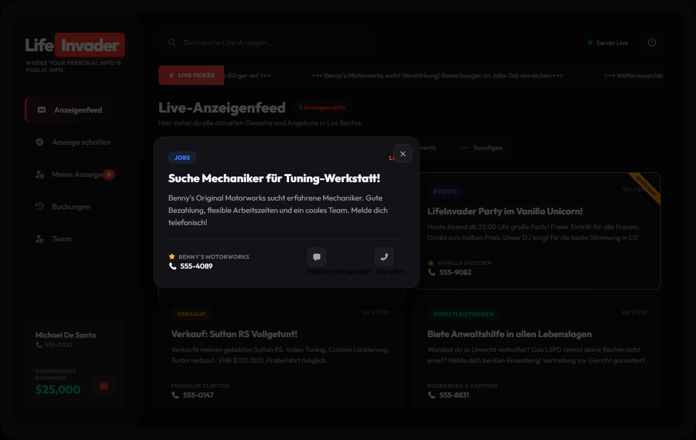

<h1 align="center">EC LifeInvader</h1>

  <strong>LifeInvader Werbesystem für FiveM</strong> — Anzeigen schalten, Feed, Guthaben, Buchungshistorie.

  
  

  

---

## Überblick

**EC LifeInvader** bringt ein vollwertiges In-Game-Werbesystem im Stil von GTA Online LifeInvader auf deinen Server: Tablet-NUI, Kategorien, Premium-Optionen und ein separates LifeInvader-Guthaben.

| Feature | Beschreibung |
| --- | --- |
| **Anzeigenfeed** | Live-Anzeigen mit Kategorien, Suche, Spotlight und Detail-Popup |
| **Anzeige schalten** | Laufzeit, Zeichenpreis, Premium (Spotlight, Anonym, Live-Ticker) |
| **Buchungshistorie** | Jede Anzeige mit **LIV-ID**, Status, Laufzeit — inkl. **Erneuern** abgelaufener Ads |
| **LifeInvader-Konto** | Einzahlen vom Bar-/Bankkonto, Abbuchung beim Schalten |
| **Meine Anzeigen** | Eigene aktive Inserate verwalten und löschen |
| **Telefon-Bridge** | SMS/Anruf per Icon (gcphone, z-phone, lsfive-phone, roadphone, lb-phone) |

Resource-Name: **`ec_lifeinvader`**

---

## Screenshots

| Feed | Anzeige schalten |
| --- | --- |
|  |  |

| Buchungshistorie | Detail-Popup |
| --- | --- |
|  |  |

---

## Installation

1. **[Release](https://github.com/EuroCent82/ec_lifeinvader/releases)** laden (`ec_lifeinvader.zip`)
2. Entpacken nach `resources/ec_lifeinvader/`
3. `config.lua` anpassen (Framework, Standorte, Telefon-Provider)
4. `ensure ec_lifeinvader` in `server.cfg`

Tabellen werden beim ersten Start automatisch angelegt (`Config.Database.autoInstall = true`).

Manueller SQL-Import: `sql/install_esx.sql` / `install_qbcore.sql` / `install_qbox.sql`

---

## Framework & Abhängigkeiten

- **ESX Legacy**, **QBCore** oder **Qbox**
- **oxmysql** oder **mysql-async**
- Optional: **ox_target** / **qb-target**, Phone-Resource (siehe `readme_config.md`)

---

## Konfiguration

Alle Optionen sind in **`config.lua`** und **`readme_config.md`** dokumentiert (Standorte, Preise, Permissions, Fake-Demo-Daten, Blips).

---

## Version 1.1.4

- Blip-Name „LifeInvader“ via AddTextEntry (Sprite 407 zeigte „Information“)
- NPC-Spawn: Mutex entfernt, Retry, Native-Zone-Fallback, `spawnZOffset` für MLO

## Version 1.1.3

- Blips wie Banking: gleicher Name, kein Lester-Sprite (77), keine Custom-Category
- Kein Dreifach-Spawn beim Resource-Start

## Version 1.1.2

- Blip-Legende: `AddTextEntry` für Kategorie (kein „ : LifeInvader“ mehr)
- Beide Standorte mit Blip (Pillbox wieder aktiv)

## Version 1.1.1

- Blips: ein Marker pro Standort, gruppiert als „LifeInvader“ (`Config.Blip` + optional `blipLabel`)
- Buchungs-Popup: Rechnungsaufschlüsselung inkl. Premium-Kosten
- Tooltips für Kontakt-Icons (Feed + Modal)

## Version 1.1.0

- Buchungshistorie, Erneuern, Feed-Popup, Kontakt-Icons

---

Entwicklung: privates Repo <code>ec_lifeinvader_dev</code> · Runtime: <code>ec_lifeinvader</code>

