<h1 align="center">EC LifeInvader</h1>

  <strong>LifeInvader Werbesystem für FiveM</strong> — Anzeigen schalten, Feed, Guthaben, Ingame-Nachrichten.

  
  
  

  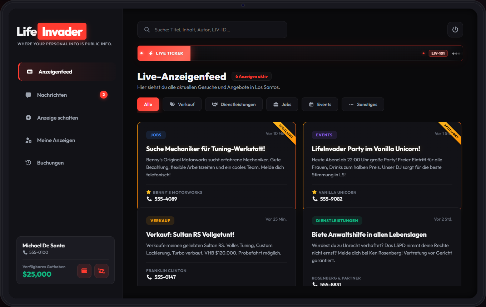

---

## Überblick

**EC LifeInvader** bringt ein vollwertiges In-Game-Werbesystem im Stil von GTA Online LifeInvader auf deinen Server: Tablet-NUI, Kategorien, Premium-Optionen, LifeInvader-Guthaben und **eigenes Nachrichtensystem** — ohne gcphone, NPWD oder andere Phone-Bridges.

| Feature | Beschreibung |
| --- | --- |
| **Anzeigenfeed** | Live-Anzeigen mit Kategorien, Suche, Spotlight und Detail-Popup |
| **Anzeige schalten** | Laufzeit, Zeichenpreis, Premium (Spotlight, Anonym, Live-Ticker) |
| **Nachrichten** | Ingame-Chat pro Anzeige — Badge beim Öffnen, ungelesen oben, nach ~12 s gelesen |
| **Benachrichtigungen** | GTA-Feed (`CHAR_LIFEINVADER`) bei neuen Chat-Nachrichten · Test: `/linotify` |
| **Buchungshistorie** | Jede Anzeige mit **LIV-ID**, Status, Laufzeit — inkl. **Erneuern** abgelaufener Ads |
| **LifeInvader-Konto** | Ein-/Auszahlen mit Slider, Schnellbeträgen und **Alles** (Bar/Bank) |
| **Meine Anzeigen** | Eigene aktive Inserate verwalten, verlängern und löschen |
| **Telefonnummer** | IC-Nummer aus Inventar/Charinfo — Anzeige und Kopieren beim Schalten |
| **Team-Panel** | Moderation, Blacklist, Rückerstattungen, Live-Ticker, **Nachrichtenverlauf** |

Resource-Name: **`ec_lifeinvader`**

---

## Screenshots

### Spieler-Ansicht

| Anzeigenfeed | Anzeige schalten | Guthaben einzahlen |
| --- | --- | --- |
|  | 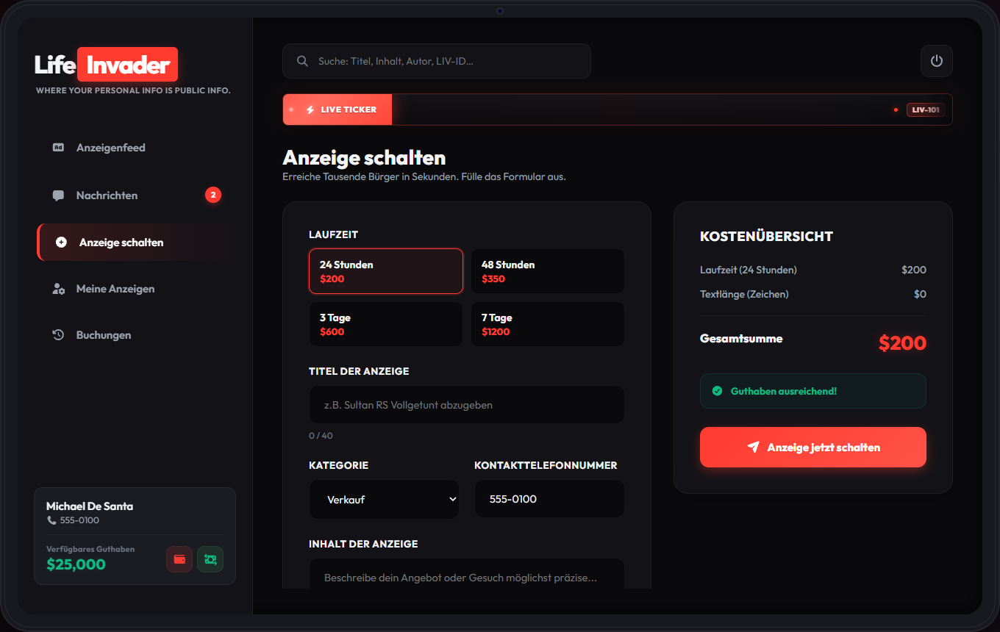 | 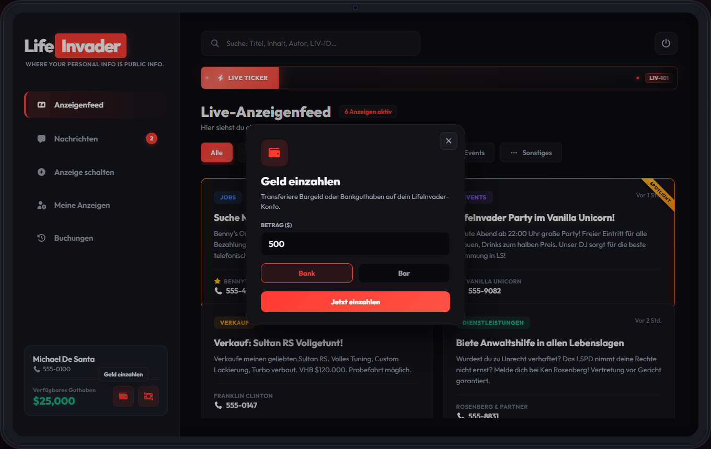 |

| Guthaben auszahlen | Nachrichten | Meine Anzeigen |
| --- | --- | --- |
| 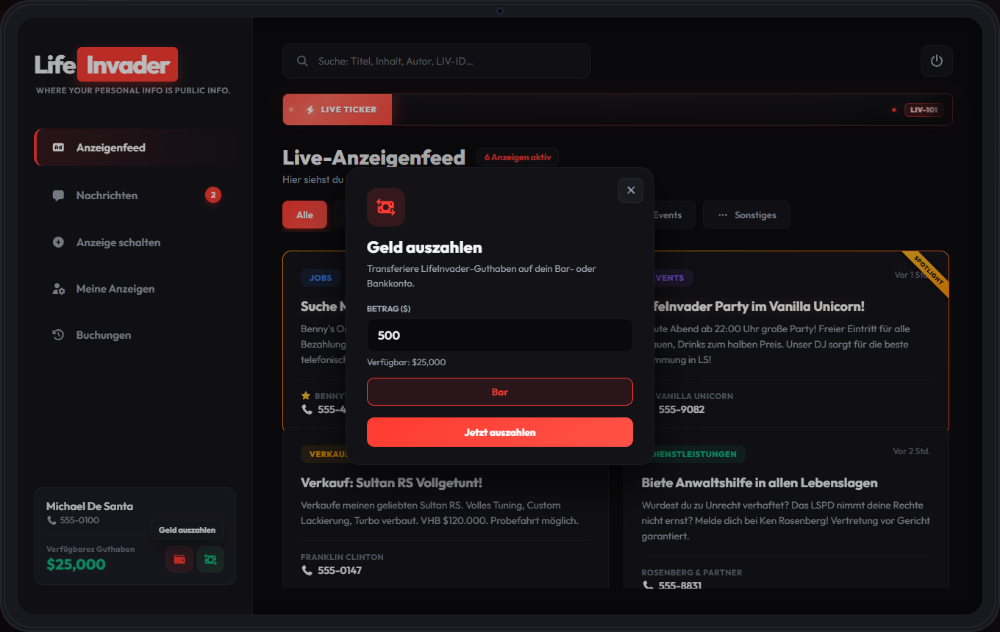 | 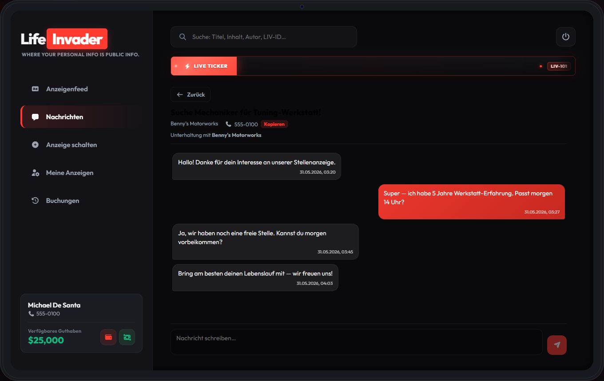 | 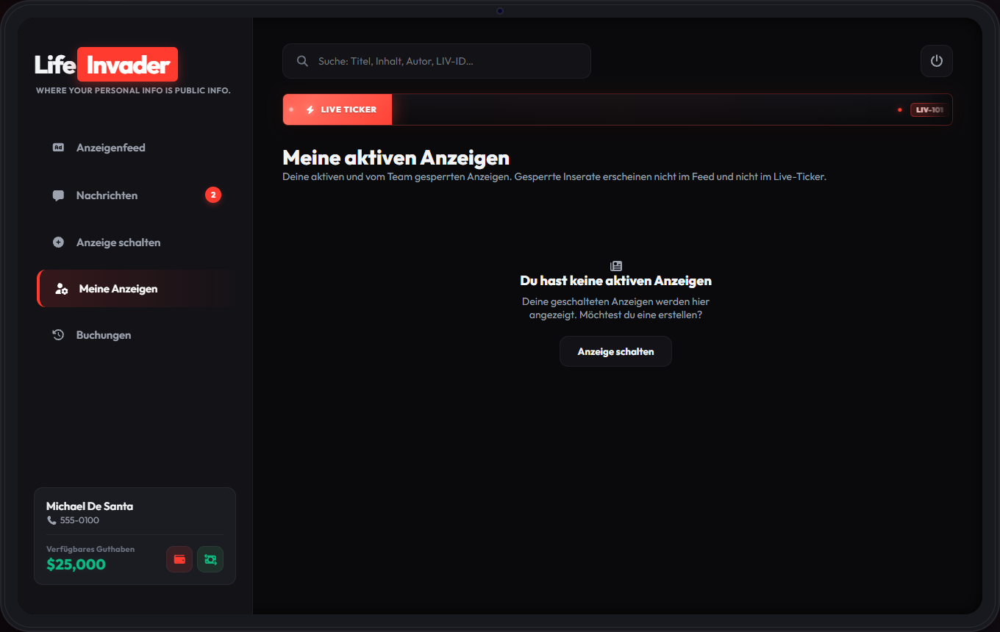 |

| Buchungen |
| --- |
| 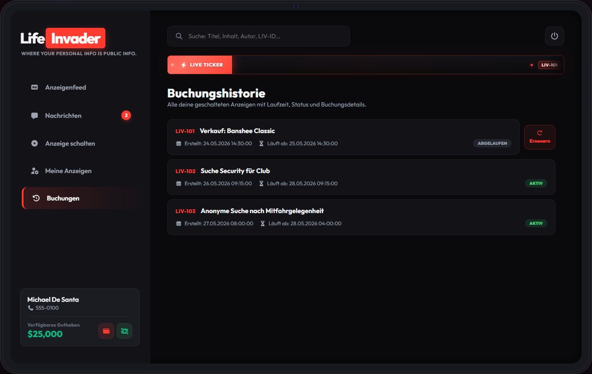 |

### Team-Ansicht

| Kategorien | Gutscheine | Live-Ticker |
| --- | --- | --- |
| 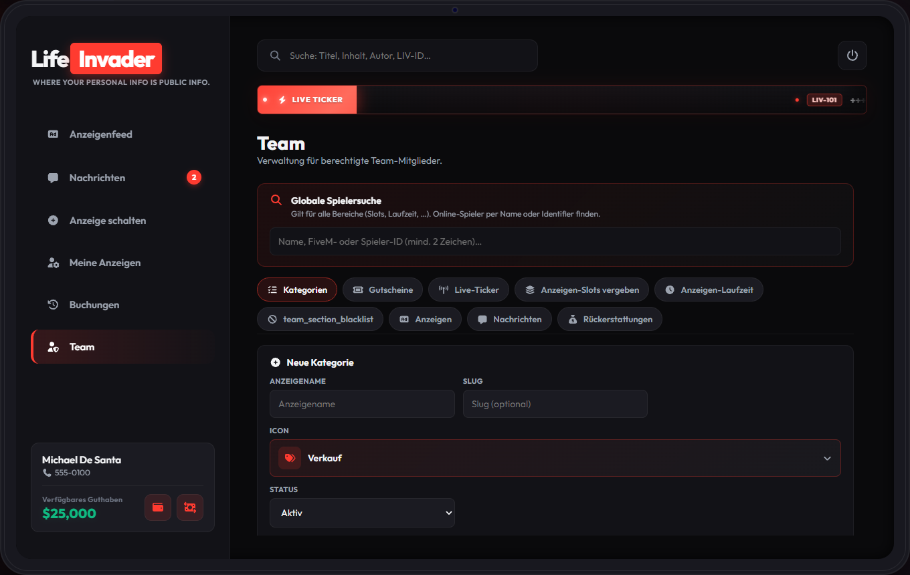 | 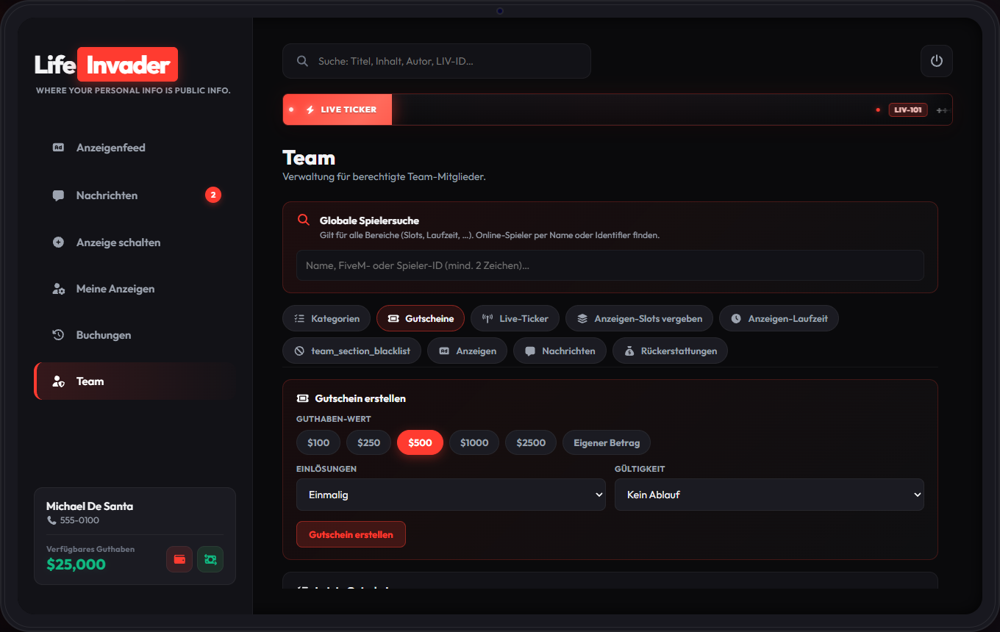 | 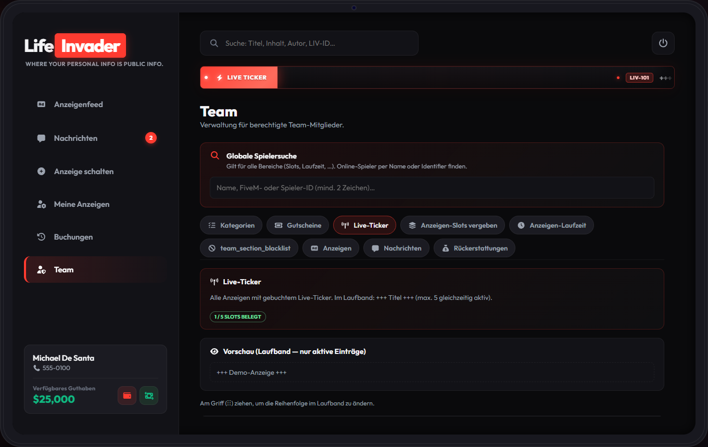 |

| Anzeigen-Slots | Anzeigen-Laufzeit | Blacklist |
| --- | --- | --- |
| 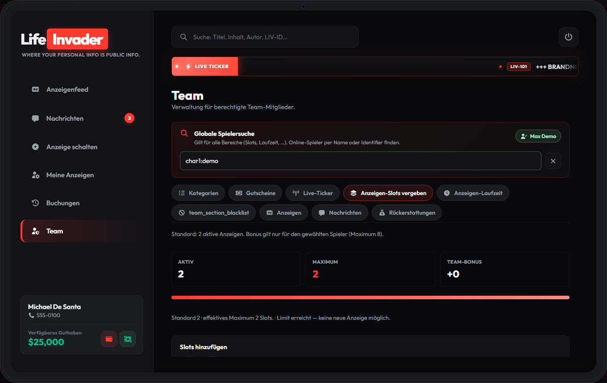 | 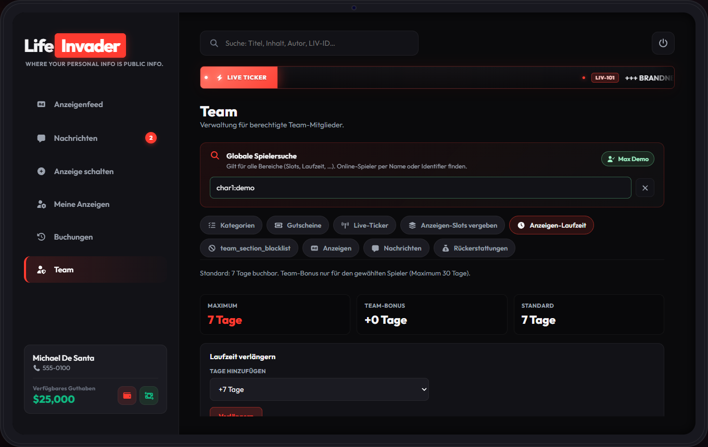 | 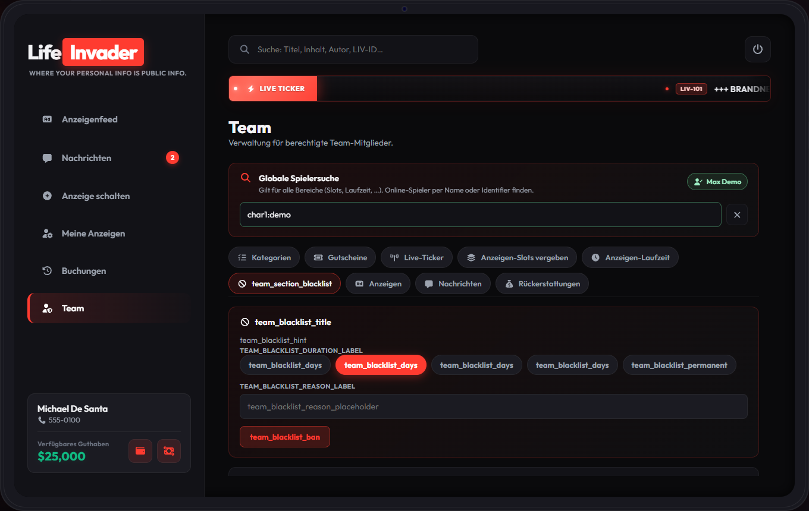 |

| Anzeigen | Nachrichten | Rückerstattungen |
| --- | --- | --- |
| 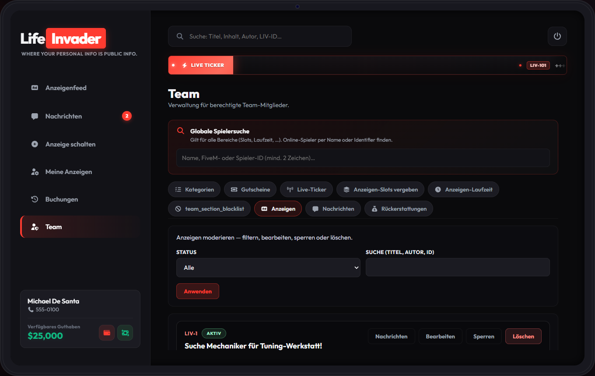 | 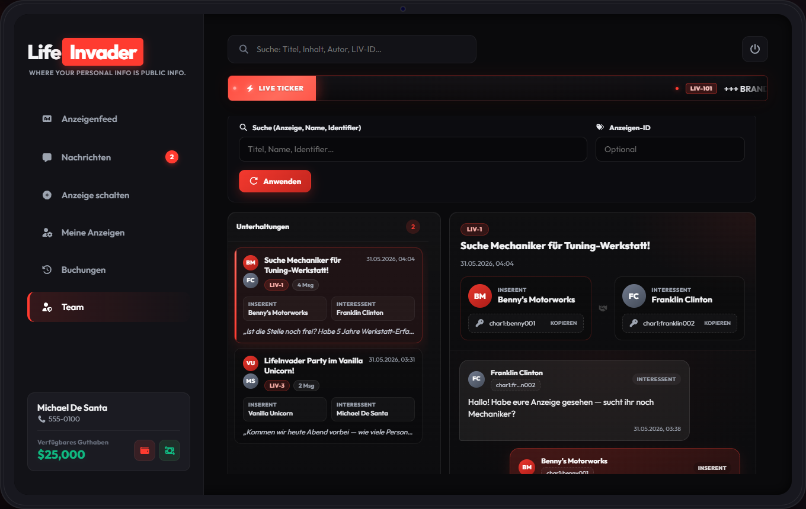 | 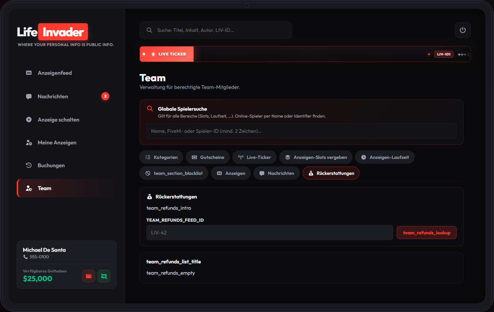 |

---

## Installation

1. **[Release](https://github.com/EuroCent82/ec_lifeinvader/releases)** laden (`ec_lifeinvader.zip`)
2. Entpacken nach `resources/ec_lifeinvader/`
3. `config.lua` anpassen (Framework, Standorte, Permissions)
4. `ensure ec_lifeinvader` in `server.cfg`

Tabellen werden beim ersten Start automatisch angelegt (`Config.Database.autoInstall = true`).

Manueller SQL-Import: `sql/install_esx.sql` / `install_qbcore.sql` / `install_qbox.sql`

Bei Update von älteren Versionen: `livdb fix` oder SQL-Import — u. a. Tabellen `lifeinvader_conversations` und `lifeinvader_messages`.

**Admin / DB:** `livdb check` · `livdb fix` · `livdb unread-reset [conversationId]` (Gelesen-Status für Tests zurücksetzen) — Details: **[commands.md](./commands.md)**

---

## Framework & Abhängigkeiten

- **ESX Legacy**, **QBCore** oder **Qbox**
- **oxmysql** oder **mysql-async**
- **ox_lib**
- Optional: **ox_target** / **qb-target**

Keine externe Phone-Resource nötig — Kontakt läuft über das integrierte Nachrichtensystem.

---

## Konfiguration

Alle Optionen sind in **`config.lua`** dokumentiert (Standorte, Preise, Permissions, Blips, Nachrichten, Ein-/Auszahlung, Notify-Texte).

Nachrichten-Benachrichtigungen: `Config.Messages.notifications` (Sender, `CHAR_LIFEINVADER`, Texte für Inserent/Interessent).

Nach Änderungen: Resource neu starten.

---

## WICHTIG: Karten-Blip & FiveM Game Build

> **Unbedingt lesen**, bevor du Blip-Sprite oder Legenden-Namen als Bug meldest.

LifeInvader nutzt **Sprite 77** (rotes **„L“** auf der Karte). Der Name **„LifeInvader“** in der Legende kommt aus `Config.Blip.label` via `EndTextCommandSetBlipName`.

### Auf Game Build `b3407` (viele aktuelle FiveM-Installationen)

- **Legende zeigt oft „Lester“** statt **„LifeInvader“**.
- **Ursache:** Auf `b3407` crasht `EndTextCommandSetBlipName`. Die Resource setzt den Namen deshalb absichtlich nicht (`Config.Blip.nameMode = 'auto'`, Build `3407` in `disableNameForBuilds`).
- **Das rote L auf der Karte ist korrekt** — nur der **Text in der Legende** fällt auf den GTA-Standard zurück.

### Einstellungen in `config.lua`

| Option | Bedeutung |
| --- | --- |
| `sprite = 77` | Rotes L (LifeInvader-Style) |
| `nameMode = 'auto'` | Namen auf problematischen Builds überspringen (empfohlen) |
| `disableNameForBuilds = { [3407] = true }` | Schutz vor Crash auf `b3407` |

---

## Version 1.2.1

- **Nachrichtensystem:** Posteingang, Chat pro Anzeige, Team-Verlauf · ungelesen oben · Gelesen nach ~12 s im Chat
- **Benachrichtigungen:** GTA Advanced Notification (`CHAR_LIFEINVADER`) für Inserent & Interessent · `/linotify` zum Testen
- **Guthaben:** Auszahlung + Ein-/Auszahl-UI (Slider, Schnellbeträge, „Alles“ je Bar/Bank/LifeInvader-Guthaben)
- **UI:** Nachrichten-Badge direkt beim Tablet-Öffnen · „Anzeige ansehen“ im Chat ohne doppelten Nachrichten-Button
- **Entfernt:** Externe Telefon-Bridges (gcphone, z-phone, roadphone, lb-phone)
- **Sonstiges:** GameBuild-Badge · 16 Spieler-Screenshots (inkl. Auszahlung) · `livdb unread-reset`

## Version 1.1.35

- Sidebar/Meine-Anzeigen-Layout, Live-Ticker (LIV-ID), Feed-Suche nach LIV-ID, Team-Bearbeiten als Vollseite

## Version 1.1.31

- **Blacklist**, Team-Anzeigen, Rückerstattungen, `/lifeinvader` Remote-Open

---

Entwicklung: privates Repo <code>ec_lifeinvader_dev</code> · Runtime: <code>ec_lifeinvader</code>

